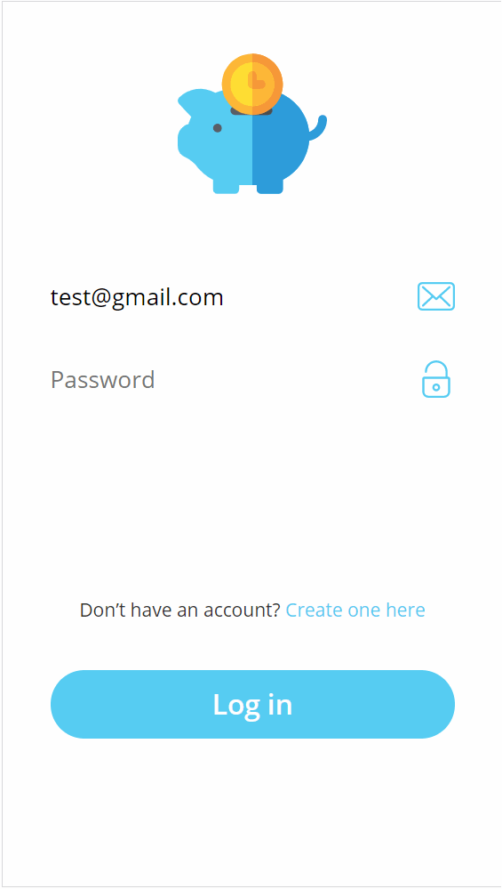

# JavaScript Open Bank

  

This project is an open source, full stack para-bank application. It features mobile-first design, allows multiple currencies and performing transactions between users. It is using TypeScript on both front- and back-end for clean and scalable development.

**For convenience, demo application is deployed and accessible here (so far mobile-only):**

https://bank-proj.firebaseapp.com/

#### 

## Backend technology stack
Backend service source-code can be found here: [bank-core](https://github.com/radoslaw-medryk/bank-core).

- TypeScript
- Node.js
- koa (HTTP server, [npm here](https://www.npmjs.com/package/koa))
- JWT tokens for auth
- PostgreSQL
- slonik (PostgreSQL client, [npm here](https://www.npmjs.com/package/slonik))
- and more...

The backend service is based on Node.js and is built as **REST API**, with authentication using JWT tokens. Service is communicating with PostgreSQL database where the data about users, accounts, transactions and so on is stored.

One of the main concerns while developing the backend service were **data consistency** and reasonable performance. In application like banking software loosing consistency of the data is catastrophic. Because of that decision was made to write the core of business logic as **stored functions in PostgresSQL**. This allowed to make the best use of PostgreSQL's **consistency and atomicity** promises, ensuring that the database will never be left in inconsistent state without need to use heavy-weighted transactions in multiple query scenario. That task was made easy thanks to great JS PostgreSQL client [slonik](https://www.npmjs.com/package/slonik), which uses modern string template syntax to allow creating readible and clean queries.

API data models are separated into another project consumed as npm package, [bank-core-shared](https://github.com/radoslaw-medryk/bank-core-shared).

## Frontend technology stack
Frontend application source-code can be found here: [bank-app](https://github.com/radoslaw-medryk/bank-app).

- TypeScript
- React
- Redux + Thunk
- Linaria (CSS in JS, [npm here](https://www.npmjs.com/package/linaria))
- and more...

Frontend application is utilizing React with TypeScript, Linaria for CSS and Redux with Thunks for state management. This combination of technologies keep the application well structured, allows for easy scaling and debugging with tools like Redux DevTools.

Linaria is interesting addition here, compared to more popular Styled-Components. While maintaining familiar syntax, Linaria removes the runtime CSS generation present in Styled-Components, utilizing instead [Custom CSS Properties](https://developer.mozilla.org/en-US/docs/Web/CSS/--*) to allow dynamic styling.

Redux Thunk is used for making side-effects, like API calls, while dispatching actions.

## How to run locally
*Note: npm scripts were written for Linux's Bash shell and may not work properly on e.g. Windows.*

#### Backend service
- Clone repo [bank-core](https://github.com/radoslaw-medryk/bank-core.git)
- `npm install`
- `npm run db` *(requires docker)*
- `npm run start`

#### Frontend service
*Backend service must be already running locally*
- Clone repo [bank-app](https://github.com/radoslaw-medryk/bank-app.git)
- `npm install`
- `npm run start`

## Still left `TODO`:
- Desktop/Tablet friendly version (mobile only so far)
- Manage accounts (open accounts for new currencies)
- Manage friends (so far a few predefined friends)
- Currency exchange functionality (with varying exchange rate, etc.)
- And more...
